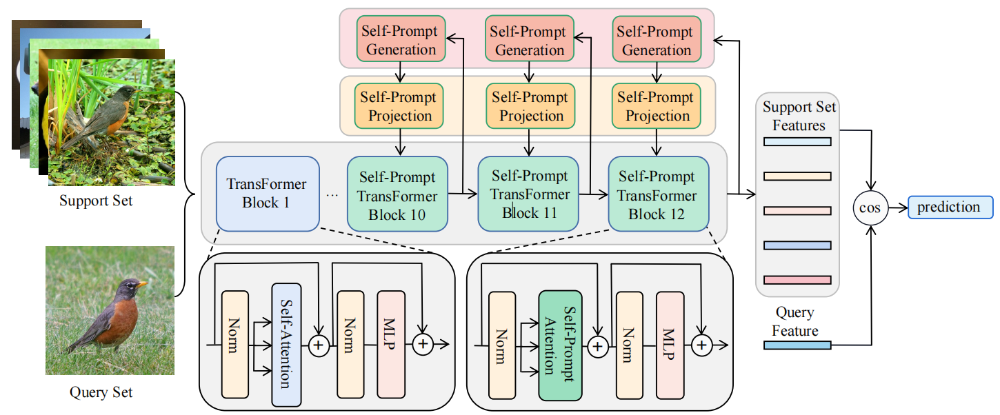

# SPM: Self-Prompt Mechanism for Few-Shot Image Recognition
## Pipline
Our proposed self-prompt mechanism generates accurate self-prompt information by selecting deep layer features of
the network in spatial and channel dimensions and then transmitting this self-prompt information to the deeper layers of the
network, thereby modifying the calculation process of self-attention to guide network training.


## Requirements
Listed in `requirements.txt` Install with：
```
pip install -r requirements.txt
```
The code was tested with Python 3.8.1 and Pytorch >= 1.7.0.
We experimented on a single GEFORCE RTX 3090. 
The minimum GPU memory is 24GB. 

## Datasets
We provide dataset classes and DDP dataloaders for CIFAR-FS, Mini-ImageNet and CDFSL(https://arxiv.org/abs/1912.07200v3) to our pipeline.

The overall structure of the `datasets` folder is the following:
```
datasets/
├── cdfsl/                     # CDFSL datasets
├── episodic_dataset.py        # CIFAR-FS & Mini-ImageNet
├── __init__.py                # summary & interface
├── mini_imagenet.py       # Mini-ImageNet
├── cifar_fs.py        # CIFAR-FS
```

### CIFAR-FS and Mini-ImageNet
```
cd scripts
sh download_cifarfs.sh
sh download_miniimagenet.sh
```
To use these two datasets, set `--dataset cifar_fs` or `--dataset mini_imagenet`.

### CDFSL
The purpose of this benchmark is to evaluate how model trained on Mini-ImageNet (source domain) performs on cross-domain meta-test tasks. 
So we only need to download the [target domains](https://github.com/yunhuiguo/CVPR-2021-L2ID-Classification-Challenges#target-domains), and extract the files into `./data/`.
You'll need to have these 4 sub-folders: 
```
./data/ChestX
./data/CropDiseases
./data/EuroSAT/2750
./data/ISIC
```
Check [get_bscd_loader()](datasets/__init__.py#L158) for the data loader details.

## Meta-Training

### On CIFAR-FS and Mini-ImageNet
It is recommended to run on a single GPU first by specifying `args.device = cuda:i`, where i is the GPU id to be used. 
We use `args.nSupport` to set the number of shots. For example, 5-way-5-shot training command of CIFAR-FS writes as
```
python main.py --output outputs/your_experiment_name --dataset cifar_fs --epoch 20 --lr 5e-5 --arch dino_small_patch16 --device cuda:0 --nSupport 5 --fp16
```
Because at least one episode has to be hosted on the GPU, the program is quite memory hungry. Mixed precision (`--fp16`) is recommended.

## Meta-Testing

### For datasets without domain shift
Copy the same command for training and add `--eval`. For example, 5-way-5-shot training command of CIFAR-FS writes as：
```
python main.py --output outputs/your_experiment_name --dataset cifar_fs --epoch 20 --lr 5e-5 --arch dino_small_patch16 --device cuda:0 --nSupport 5 --fp16 --eval
```

### Cross-domain few-shot learning
Meta-testing CDFSL is almost the same as described in previous section for Meta-Dataset. However, we create another script [test_bscdfsl.py](test_bscdfsl.py) to fit CDFSL's original data loaders. 

An meta-testing command example for CDFSL with fine-tuning is
```
python test_bscdfsl.py --test_n_way 5 --n_shot 5 --device cuda:0 --arch dino_small_patch16 --deploy finetune --output outputs/your_experiment_name --resume outputs/your_experiment_name/best.pth --ada_steps 100 --ada_lr 0.0001 --aug_prob 0.9 --aug_types color transition
```
Changing `--n_shot` to 1/5/20 to evaluate other settings.

## Visualization
FSViT is the first few-shot classification method to learn the multi-scale feature sets of images via ViT. FSViT extracts rich multi-scale information with the attention-aware grid pooling operation and perform accurate classification with the patch-to-patch matching metric. It exploits the full potential of ViT for few-shot classification tasks, and outperforms existing ViT models.


Visualization of the relationship between multi-scale feature extraction and patch to patch matching metric by FSViT. We evaluated them by FSViT (ViT-small and ViT-base) and averaged over the test set of 5-way 1-shot/5-shot tasks on CFAIR-FS and Mini-Imagenet. The best classification performance is achieved when the grid pooling stride is set to 3, the number of extracted multi-scale features is 311, and the $m$ in top-m is set to 5.


## Citing P>M>F pipeline for few-shot learning 
```
@inproceedings{hu2022pmf,
               author = {Hu, Shell Xu
                         and Li, Da
                         and St\"uhmer, Jan
                         and Kim, Minyoung
                         and Hospedales, Timothy M.},
               title = {Pushing the Limits of Simple Pipelines for Few-Shot Learning:
                        External Data and Fine-Tuning Make a Difference},
               booktitle = {CVPR},
               year = {2022}
}
```
